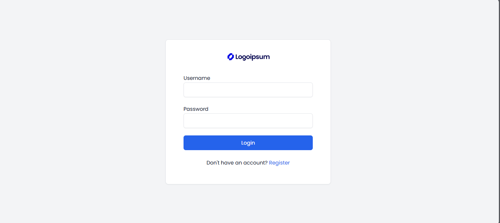
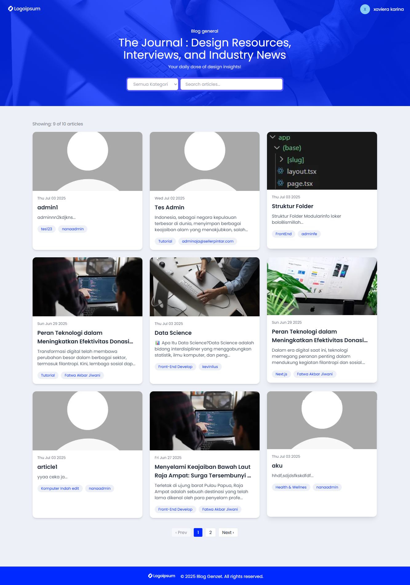
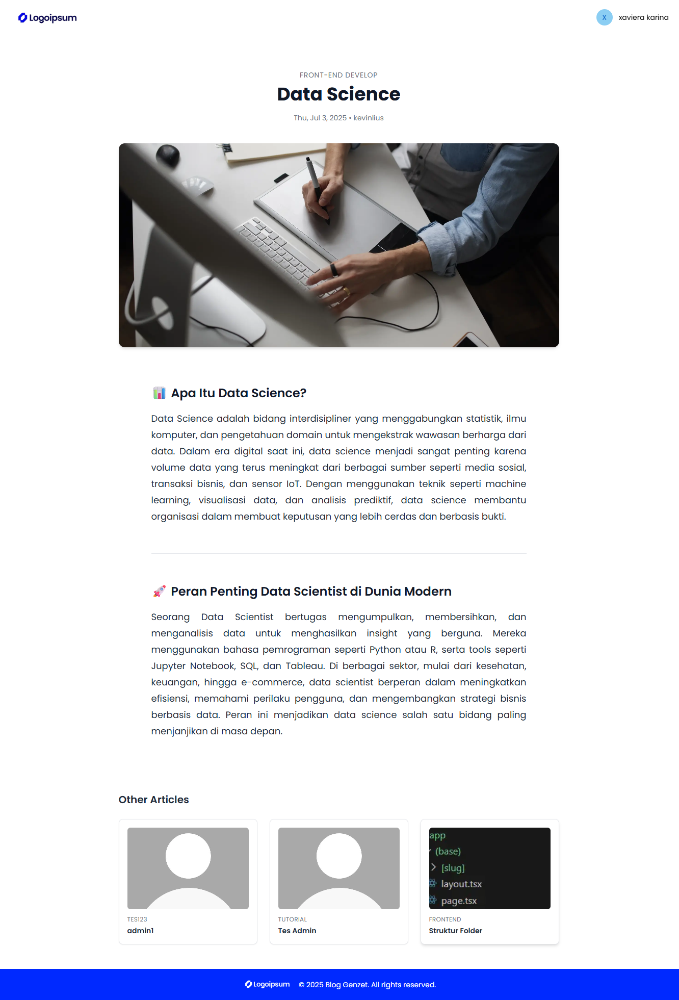
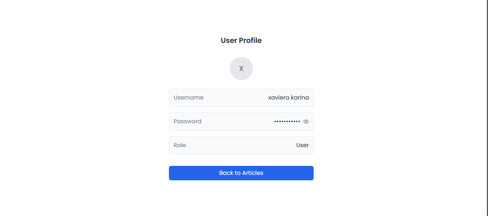
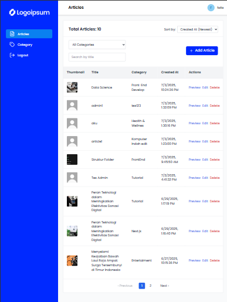

# Web Artikel

Website manajemen artikel dengan dua role (User dan Admin). User dapat membaca dan mencari artikel, sementara Admin dapat mengelola data artikel dan kategori melalui dashboard yang interaktif.

---

## 🖼️ Preview Screens

<div align="center">
  
  
  
  
  
</div>

---

## 📌 Fitur Utama

### 👤 User
- Registrasi dan Login
- Melihat daftar artikel
- Melihat detail artikel
- Filter artikel berdasarkan kategori
- Pencarian artikel
- Proteksi halaman (wajib login)

### 🔐 Admin
- Dashboard Admin
- CRUD Artikel (Create, Read, Update, Delete)
- CRUD Kategori
- Validasi dan pembatasan akses berdasarkan role
- Proteksi halaman admin

---

## 🛠️ Tech Stack

- **Frontend:** Next.js (App Router) + TypeScript
- **Styling:** Tailwind CSS + Shadcn/UI
- **Form Handling:** React Hook Form + Zod
- **API Client:** Axios
- **Icons:** Lucide Icons
- **Editor:** Tiptap Rich Text Editor
- **Auth:** Token-based Auth dengan Middleware Client-side

---

## 🚀 Cara Menjalankan Project

1. **Clone repository**

```bash
git clone https://github.com/yourusername/project-name.git
cd project-name

2. **Install dependencies**
npm install

3. **Jalankan development server**
npm run dev

4. **Akses Aplikasi**
Buka di browser: http://localhost:3000
